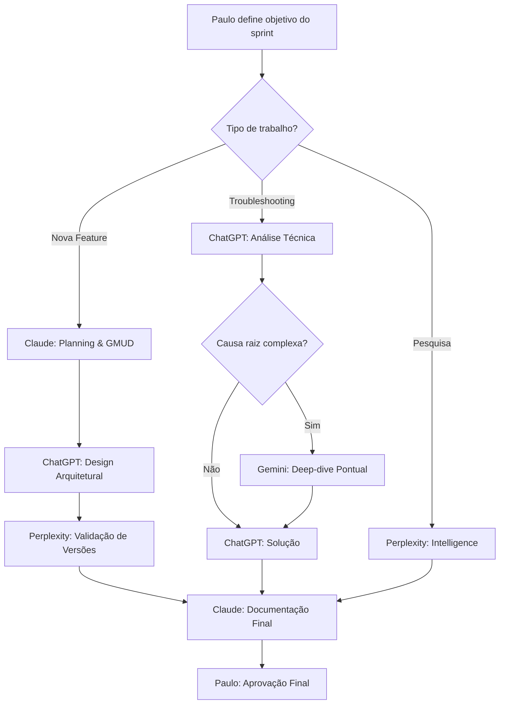

# 

**Status:** ✅ Aceito  
**Data:** 28/12/2025  
**Decisor:** Paulo Feitosa (Owner - Fiqueok)  
**Contexto:** Lab Fiqueok 2.0 - Plataforma de Aprendizado GRC/IAM

---

## 📋 Contexto e Problema

### Situação Anterior (v1.0)
A distribuição inicial de papéis entre as IAs foi baseada em **capacidades teóricas** sem validação prática em ambiente de projeto de longo prazo.

**Problemas Identificados:**
1. **Gemini Pro como "Strategic Partner":**
   - ❌ Esquecimento frequente de contexto histórico
   - ❌ Forte viés técnico mesmo após ajustes de prompt
   - ❌ Priorização de tasks sobre governança
   - ❌ Incapacidade de manter coerência entre sprints

2. **Claude subutilizado:**
   - ⚠️ Confinado apenas a documentação formal
   - ⚠️ Capacidade de governança estratégica não explorada
   - ⚠️ Melhor memória de contexto desperdiçada

3. **ChatGPT limitado a execução:**
   - ⚠️ Capacidade arquitetural não aproveitada
   - ⚠️ Confiabilidade técnica não explorada para decisões

### Impacto no Projeto
- 🔴 **Perda de continuidade:** Decisões arquiteturais esquecidas entre sessões
- 🔴 **Retrabalho:** Necessidade de re-briefing constante do Gemini
- 🟡 **Documentação desconectada:** Claude não participava de decisões estratégicas

---

## 🎯 Decisão

### Nova Distribuição de Papéis (v2.0)

#### **1. Claude - Chief Documentation Officer & GRC Lead**
**Responsabilidades EXPANDIDAS:**

**Governança & Estratégia:**
- 🎯 Guardião da visão de longo prazo (memory keeper)
- 📊 Planejamento de roadmaps e faseamento
- 🧭 Decisões arquiteturais de alto nível (viés GRC)
- 🔄 Gestão de dependências entre GMUDs
- ⚠️ Alerta de desvios do plano original

**Documentação & Compliance:**
- ✍️ Redação de GMUDs (padrão enterprise)
- 📋 RNCs e relatórios de auditoria
- 📐 Memoriais descritivos de arquitetura
- 🗺️ Mapeamento de controles (ISO/NIST/CIS)
- 📚 Consolidação de lições aprendidas

**Justificativa:**
- ✅ Melhor memória de contexto em conversas longas
- ✅ Equilibra visão técnica + negócio + compliance
- ✅ Não se distrai com "shiny objects" técnicos
- ✅ Mantém tom executivo e rigor analítico

---

#### **2. ChatGPT - Senior Systems Architect & Lead Engineer**
**Responsabilidades EXPANDIDAS:**

**Arquitetura Técnica:**
- 🏗️ Design de topologias de rede (VLANs, routing)
- 🔐 Decisões de segurança técnica (ACLs, encryption)
- 🐳 Arquitetura de containers e orquestração
- 📊 Análise de trade-offs (performance vs. segurança)

**Implementação & Automação:**
- 🤖 Playbooks Ansible e automação
- 💻 Scripts PowerShell/Bash
- 🔧 Docker Compose e IaC
- 🧪 Troubleshooting e debugging

**Justificativa:**
- ✅ Consistência em respostas técnicas
- ✅ Código funcional de primeira (baixa taxa de erro)
- ✅ Equilibra arquitetura + implementação
- ✅ Mais "hands-on" que Gemini (ideal para labs)

---

#### **3. Gemini Pro - Technical Specialist & Deep-Dive Consultant**
**Responsabilidades REDUZIDAS e FOCADAS:**

**Consultas Técnicas Pontuais:**
- 🔬 Deep-dives em tecnologias específicas
- 🆚 Comparações técnicas detalhadas
- 🧠 Brainstorming de soluções alternativas
- 📖 Explicações didáticas de conceitos

**O que Gemini NÃO fará mais:**
- ❌ Planejamento de roadmaps (requer memória)
- ❌ Decisões arquiteturais finais (requer contexto)
- ❌ Gestão de dependências entre fases
- ❌ Acompanhamento de evolução do projeto

**Regras de Engajamento:**
- ✅ Sessões isoladas com briefing completo
- ✅ Perguntas específicas sem assumir conhecimento prévio
- ✅ Análises pontuais sem follow-up esperado
- ✅ Validação de conceitos antes de implementar

**Justificativa:**
- ⚠️ Limitação de memória comprovada
- ⚠️ Viés técnico forte (dificulta governança)
- ✅ Excelente em análises profundas isoladas
- ✅ Valioso para brainstorming técnico pontual

---

#### **4. Perplexity Pro - Intelligence Officer & Validation Specialist**
**Responsabilidades MANTIDAS:**

**Research & Intelligence:**
- 🔎 Pesquisa de CVEs e vulnerabilidades
- 📰 Monitoramento de tendências
- 🆚 Comparação de ferramentas (dados atualizados)
- ✅ Validação de versões e compatibilidade

**Justificativa:**
- ✅ Único com acesso a web search
- ✅ Excelente em fontes primárias
- ✅ Menos propenso a "alucinar" fatos
- ✅ Bom em fact-checking de outras IAs

---

## 📊 Matriz RACI - Processos-Chave

### Legenda RACI
- **R** (Responsible): Executa a tarefa
- **A** (Accountable): Responsável final (decision maker)
- **C** (Consulted): Consultado antes da decisão
- **I** (Informed): Informado após a decisão

---

### **1. Planejamento de Roadmap**

| Atividade | Claude | ChatGPT | Gemini | Perplexity | Paulo |
|-----------|--------|---------|--------|------------|-------|
| Definir visão de longo prazo | **A/R** | C | - | - | **A** |
| Identificar dependências técnicas | **R** | C | - | - | I |
| Faseamento e sprints | **A/R** | C | - | - | **A** |
| Validar viabilidade técnica | C | **R** | C | I | A |

---

### **2. Implementação de GMUD**

| Atividade | Claude | ChatGPT | Gemini | Perplexity | Paulo |
|-----------|--------|---------|--------|------------|-------|
| Redação da GMUD | **A/R** | C | - | C | **A** |
| Análise de risco | **R** | C | - | - | A |
| Design arquitetural | C | **R** | C | - | I |
| Desenvolvimento de código | I | **A/R** | - | - | I |
| Pesquisa de best practices | C | C | - | **R** | I |
| Validação de implementação | **R** | C | - | C | **A** |

---

### **3. Troubleshooting de Incidentes**

| Atividade | Claude | ChatGPT | Gemini | Perplexity | Paulo |
|-----------|--------|---------|--------|------------|-------|
| Documentação do incidente | **A/R** | I | - | I | **A** |
| Análise técnica | C | **R** | C | C | I |
| Deep-dive de causa raiz | C | C | **R** | - | I |
| Pesquisa de CVEs/patches | I | I | - | **R** | I |
| Plano de remediação | **R** | C | - | C | **A** |

---

### **4. Decisões Arquiteturais**

| Atividade | Claude | ChatGPT | Gemini | Perplexity | Paulo |
|-----------|--------|---------|--------|------------|-------|
| Análise de trade-offs | **R** | C | C | - | **A** |
| Design de topologia | C | **R** | C | - | A |
| Mapeamento de compliance | **R** | - | - | C | A |
| Comparação de ferramentas | C | C | C | **R** | A |
| Decisão final | I | I | I | I | **A** |

---

### **5. Consultas Técnicas Pontuais**

| Atividade | Claude | ChatGPT | Gemini | Perplexity | Paulo |
|-----------|--------|---------|--------|------------|-------|
| Deep-dive técnico | - | C | **A/R** | C | I |
| Explicação didática | C | C | **R** | - | I |
| Comparação detalhada | - | C | **R** | C | I |
| Brainstorming alternativas | C | C | **R** | - | I |

---

## 🔄 Fluxo de Trabalho Padrão (Exemplo)

### **Sprint Planning → Execução → Validação**



---

## ✅ Consequências

### Positivas
1. **Continuidade Estratégica:**
   - ✅ Claude mantém visão de longo prazo entre sprints
   - ✅ Decisões documentadas e cross-referenced
   - ✅ Menos retrabalho por esquecimento

2. **Confiabilidade Técnica:**
   - ✅ ChatGPT como "braço direito" para arquitetura + código
   - ✅ Código funcional de primeira (menos debugging)
   - ✅ Consistência em recomendações técnicas

3. **Uso Otimizado de Recursos:**
   - ✅ Gemini focado onde é forte (deep-dives isolados)
   - ✅ Perplexity mantém papel crítico (web search)
   - ✅ Cada IA em zona de alta performance

### Negativas (Mitigadas)
1. **Dependência de Claude:**
   - ⚠️ Se Claude falhar, governança fica comprometida
   - ✅ **Mitigação:** Documentação em Obsidian (backup humano)

2. **Gemini Subutilizado:**
   - ⚠️ Capacidade analítica restrita a consultas pontuais
   - ✅ **Mitigação:** Ainda valioso para deep-dives complexos

3. **Curva de Aprendizado:**
   - ⚠️ Paulo precisa adaptar prompts para nova estrutura
   - ✅ **Mitigação:** Templates de prompt incluídos neste ADR

---

## 📝 Templates de Prompt

### **Para Claude (Governança):**
```markdown
# Contexto Estratégico
Projeto: Lab Fiqueok 2.0
Fase Atual: [Sprint X - Objetivo Y]
GMUDs Relacionadas: [Lista com links]

# Solicitação
[Planejamento/Decisão/Documentação específica]

# Entregas Esperadas
- [ ] Análise de impacto em outras GMUDs
- [ ] Mapeamento de controles (ISO/NIST)
- [ ] Recomendação com justificativa
```

### **Para ChatGPT (Arquitetura/Implementação):**
```markdown
# Briefing Técnico
Infraestrutura: [Resumo atual]
Objetivo: [Feature ou correção específica]
Restrições: [Budget, tempo, tecnologia]

# Solicitação
[Design arquitetural ou código]

# Entregas Esperadas
- [ ] Diagrama de arquitetura (se aplicável)
- [ ] Código funcional (com comentários)
- [ ] Análise de trade-offs
```

### **Para Gemini (Consulta Pontual):**
```markdown
# Contexto Completo (sempre incluir)
Projeto: Lab Fiqueok 2.0
Infraestrutura: [Resumo de 3 linhas]
Problema: [Descrição isolada]

# Pergunta Técnica Específica
[Pergunta que não requer follow-up]

# Entregas Esperadas
- [ ] Análise técnica detalhada
- [ ] Comparação de alternativas
- [ ] Recomendação com referências
```

### **Para Perplexity (Research):**
```markdown
# Missão de Intelligence
Tecnologia/Vulnerabilidade: [Nome específico]
Versões: [Lista de versões em uso]
Objetivo: [O que validar]

# Perguntas
1. [CVEs conhecidos?]
2. [Versões EOL?]
3. [Best practices atuais?]

# Entregas Esperadas
- [ ] Relatório com fontes primárias
- [ ] Validação de compatibilidade
- [ ] Alertas de segurança
```

---

## 🔗 Documentos Relacionados

- [[Manifesto de Estratégia e Infraestrutura (Fiqueok) v2.0]]
- [[POP-GRC-002 - Processo de Tomada de Decisão Arquitetural]]
- [[REL-GMUD-014 - Lições Aprendidas sobre Gestão de IAs]]

---

## 📊 Métricas de Sucesso

**KPIs para validar esta decisão (avaliação em 30 dias):**

| Métrica | Meta | Como Medir |
|---------|------|------------|
| Retrabalho por "esquecimento" | < 10% | Contagem de re-briefings necessários |
| Coerência entre GMUDs | > 90% | Auditoria de cross-references |
| Taxa de código funcional (1ª tentativa) | > 80% | Scripts executados sem erro |
| Tempo de deep-dive com Gemini | < 1h/sessão | Log de conversas |
| Satisfação do Owner (Paulo) | > 8/10 | Auto-avaliação mensal |

---

## 🔄 Revisão

**Próxima revisão:** 27/01/2026  
**Responsável:** Paulo Feitosa  
**Trigger de revisão antecipada:** Qualquer IA apresentar mudança significativa de capacidade

---

**Changelog:**
- v1.0 (28/12/2025): Criação do ADR
- v1.1 (28/12/2025): Adição de templates de prompt e matriz RACI
