## 📋 **TAP - Technical Assessment Plan**
### 

---

| Campo | Valor |
|-------|-------|
| **Projeto** | PRJ026 |
| **Título** | Integração midPoint 4.10 com Active Directory para Provisionamento e Governança |
| **Data** | Maio/2026 |
| **Versão** | 1.0 |
| **Status** | 📝 Em Planejamento |
| **Responsável** | Paulo Feitosa Lima |
| **Pré-requisito** | PRJ022-A (CSV → midPoint → AD) já validado |
| **Complexidade** | Baixa (conector nativo, documentação extensa) |
| **Tempo Estimado** | 1h30min |

---

## 1. Objetivo

Estabelecer integração bidirecional entre o **midPoint 4.10** e o **Active Directory** para:

1. Provisionamento automático de usuários no AD (Joiner)
2. Atualização de atributos (Mover)
3. Desativação/remoção de usuários (Leaver)
4. Gerenciamento de grupos e associações
5. Reconciliação contínua entre midPoint e AD
6. Auditoria centralizada de identidades

---

## 2. Por que Active Directory?

| Benefício | Descrição |
|-----------|-----------|
| **Conector nativo** | AdLdapConnector incluso no midPoint |
| **Maduro e testado** | Usado em centenas de projetos |
| **Bidirecional** | Sincronização em ambos os sentidos |
| **Alta performance** | Suporte a LDAP, LDAPS, GSSAPI |
| **Governança** | Base para campanhas de certificação |
| **Integração com Entra ID** | Via Azure AD Connect |

---

## 3. Arquitetura Proposta

```
┌─────────────────────────────────────────────────────────────────────────────────────┐
│                    PRJ026 - midPoint ↔ Active Directory (AD)                         │
├─────────────────────────────────────────────────────────────────────────────────────┤
│                                                                                      │
│  ┌─────────────┐     ┌─────────────────────────────────────────────────────────────┐│
│  │  Shadow API │     │                        midPoint 4.10                        ││
│  │  (PRJ008)   │────▶│  ┌───────────────────────────────────────────────────────┐  ││
│  └─────────────┘     │  │              Recurso CSV (PRJ022-A)                   │  ││
│                      │  │  employee_id, first_name, last_name, email...         │  ││
│                      │  └─────────────────────────┬─────────────────────────────┘  ││
│                      │                            │                                ││
│                      │                            ▼                                ││
│                      │  ┌───────────────────────────────────────────────────────┐  ││
│                      │  │           Resource Active Directory (AdLdap)          │  ││
│                      │  │  ┌─────────────────────────────────────────────────┐  │  ││
│                      │  │  │ • sAMAccountName                                │  │  ││
│                      │  │  │ • userPrincipalName                             │  │  ││
│                      │  │  │ • givenName / sn                                │  │  ││
│                      │  │  │ • displayName                                   │  │  ││
│                      │  │  │ • mail                                          │  │  ││
│                      │  │  │ • employeeID                                    │  │  ││
│                      │  │  │ • department / title / manager                  │  │  ││
│                      │  │  │ • memberOf (groups)                             │  │  ││
│                      │  │  └─────────────────────────────────────────────────┘  │  ││
│                      │  └─────────────────────────┬─────────────────────────────┘  ││
│                      │                            │                                ││
│                      │                            │ LDAP/LDAPS (636/389)           ││
│                      │                            ▼                                ││
│                      │  ┌───────────────────────────────────────────────────────┐  ││
│                      │  │                  Active Directory                      │  ││
│                      │  │  ┌─────────────────────────────────────────────────┐  │  ││
│                      │  │  │ Domain: fiqueok.local                          │  │  ││
│                      │  │  │ Users: 102 usuários criados                     │  │  ││
│                      │  │  │ OUs: Employees, Contractors, Service Accounts  │  │  ││
│                      │  │  │ Groups: Domain Users, Finance, HR, IT           │  │  ││
│                      │  │  └─────────────────────────────────────────────────┘  │  ││
│                      │  └───────────────────────────────────────────────────────┘  ││
│                      │                            │                                ││
│                      │                            │ Azure AD Connect               ││
│                      │                            ▼                                ││
│                      │  ┌───────────────────────────────────────────────────────┐  ││
│                      │  │              Microsoft Entra ID (Cloud)               │  ││
│                      │  └───────────────────────────────────────────────────────┘  ││
│                      │                                                              ││
│                      └──────────────────────────────────────────────────────────────┘│
└─────────────────────────────────────────────────────────────────────────────────────┘
```

---

## 4. Pré-Requisitos

| # | Requisito | Status | Critério |
|---|-----------|--------|----------|
| PR-01 | PRJ022-A funcionando (CSV) | ✅ | 103 usuários processados |
| PR-02 | Active Directory disponível | ⏳ | Domain Controller acessível |
| PR-03 | Conta de serviço no AD | ⏳ | `svc_midpoint` com permissões |
| PR-04 | Portas LDAP liberadas (389/636) | ⏳ | `telnet ad.fiqueok.local 389` |
| PR-05 | Certificado TLS (opcional) | ⏳ | Para LDAPS |
| PR-06 | Esquema AD estendido (employeeID) | ⏳ | Atributo disponível |

### 4.1. Conta de Serviço no AD

```powershell
# [PowerShell no Domain Controller]
New-ADUser -Name "svc_midpoint" `
    -UserPrincipalName "svc_midpoint@fiqueok.local" `
    -GivenName "MidPoint" `
    -Surname "Service" `
    -DisplayName "MidPoint Service Account" `
    -Description "Conta de serviço para integração midPoint" `
    -AccountPassword (ConvertTo-SecureString "SvcM1dP0!nt#2026" -AsPlainText -Force) `
    -Enabled $true `
    -PasswordNeverExpires $true

# Adicionar ao grupo Domain Admins (ou permissões específicas)
Add-ADGroupMember -Identity "Domain Admins" -Members "svc_midpoint"

# OU permissões mínimas (recomendado para produção)
# Delegar controle sobre OU específica
```

---

## 5. Estrutura do Active Directory

### 5.1. Organizacional Units (OUs)

```
DC=fiqueok,DC=local
├── OU=Employees
│   ├── OU=Active
│   └── OU=Terminated
├── OU=Contractors
├── OU=Service Accounts
└── OU=Groups
    ├── CN=Finance
    ├── CN=HR
    └── CN=IT
```

### 5.2. Atributos AD vs midPoint

| Atributo AD | Atributo midPoint | Regra | Direção |
|-------------|-------------------|-------|---------|
| `sAMAccountName` | `name` | `first_name.last_name` | inbound/outbound |
| `userPrincipalName` | `email` | `first_name.last_name@fiqueok.local` | outbound |
| `givenName` | `givenName` | Direto | inbound/outbound |
| `sn` | `familyName` | Direto | inbound/outbound |
| `displayName` | `fullName` | `givenName + " " + familyName` | inbound/outbound |
| `mail` | `email` | Direto | inbound/outbound |
| `employeeID` | `personalNumber` | Direto (`FP001`) | inbound/outbound |
| `department` | `costCenter` | Mapeamento | inbound/outbound |
| `manager` | `manager` | DN do gerente | inbound/outbound |
| `memberOf` | `groups` | Nomes dos grupos | inbound/outbound |
| `telephoneNumber` | `phone` | Direto | inbound/outbound |
| `title` | `title` | Direto | inbound/outbound |

---

## 6. Configuração do Resource no midPoint

### 6.1. Descobrir OID do AdLdapConnector

```bash
# [iga-gf-02]$
curl -s -u administrator:'M1dP0!ntAdm!n#2026' \
  "http://xxx.xxx.xxx.xxx:8080/midpoint/ws/rest/connectors" \
  | jq '.[] | {name: .name, oid: .oid}' | grep -A 1 -i "adldap"
```

### 6.2. Configuração via XML (Recomendado)

```xml
<?xml version="1.0" encoding="UTF-8"?>
<resource xmlns="http://midpoint.evolveum.com/xml/ns/public/common/common-3"
          xmlns:c="http://midpoint.evolveum.com/xml/ns/public/connector/icf-1/connector-schema-3"
          xmlns:ri="http://midpoint.evolveum.com/xml/ns/public/resource/instance-3">

    <name>Active Directory (fiqueok.local)</name>
    <description>Integração com Active Directory para provisionamento de usuários</description>
    <lifecycleState>active</lifecycleState>

    <connectorRef oid="20f08b13-5ba3-414b-bfb9-0842e290c7e1"/>

    <connectorConfiguration>
        <configuration>
            <c:host>ad.fiqueok.local</c:host>
            <c:port>389</c:port>
            <c:connectionSecurity>starttls</c:connectionSecurity>
            <c:sslProtocol>TLSv1.2</c:sslProtocol>
            <c:authenticationType>simple</c:authenticationType>
            <c:principal>cn=svc_midpoint,ou=Service Accounts,dc=fiqueok,dc=local</c:principal>
            <c:credentials>
                <c:password>SvcM1dP0!nt#2026</c:password>
            </c:credentials>
            <c:baseContexts>
                <c:baseContext>dc=fiqueok,dc=local</c:baseContext>
            </c:baseContexts>
            <c:accountBaseContext>ou=Employees,dc=fiqueok,dc=local</c:accountBaseContext>
            <c:groupBaseContext>ou=Groups,dc=fiqueok,dc=local</c:groupBaseContext>
            <c:accountSynchronization>
                <c:enabled>true</c:enabled>
            </c:accountSynchronization>
        </configuration>
    </connectorConfiguration>

    <schemaHandling>
        <!-- Definição do Object Type para usuários -->
        <objectType>
            <kind>account</kind>
            <intent>user</intent>
            <displayName>AD User</displayName>
            <description>Usuário do Active Directory</description>

            <!-- Mapeamentos -->
            <attribute>
                <ref>ri:name</ref>
                <displayName>sAMAccountName</displayName>
                <inbound>
                    <strength>strong</strength>
                    <target>
                        <path>name</path>
                    </target>
                </inbound>
                <outbound>
                    <strength>strong</strength>
                    <source>
                        <path>name</path>
                    </source>
                </outbound>
            </attribute>

            <attribute>
                <ref>ri:cn</ref>
                <displayName>Common Name</displayName>
                <outbound>
                    <source>
                        <path>fullName</path>
                    </source>
                </outbound>
            </attribute>

            <attribute>
                <ref>ri:givenName</ref>
                <inbound>
                    <target>
                        <path>givenName</path>
                    </target>
                </inbound>
                <outbound>
                    <source>
                        <path>givenName</path>
                    </source>
                </outbound>
            </attribute>

            <attribute>
                <ref>ri:sn</ref>
                <displayName>Surname</displayName>
                <inbound>
                    <target>
                        <path>familyName</path>
                    </target>
                </inbound>
                <outbound>
                    <source>
                        <path>familyName</path>
                    </source>
                </outbound>
            </attribute>

            <attribute>
                <ref>ri:displayName</ref>
                <inbound>
                    <target>
                        <path>fullName</path>
                    </target>
                </inbound>
                <outbound>
                    <source>
                        <path>fullName</path>
                    </source>
                </outbound>
            </attribute>

            <attribute>
                <ref>ri:userPrincipalName</ref>
                <outbound>
                    <source>
                        <path>email</path>
                    </source>
                </outbound>
            </attribute>

            <attribute>
                <ref>ri:mail</ref>
                <inbound>
                    <target>
                        <path>email</path>
                    </target>
                </inbound>
                <outbound>
                    <source>
                        <path>email</path>
                    </source>
                </outbound>
            </attribute>

            <attribute>
                <ref>ri:employeeID</ref>
                <inbound>
                    <strength>strong</strength>
                    <target>
                        <path>personalNumber</path>
                    </target>
                </inbound>
                <outbound>
                    <source>
                        <path>personalNumber</path>
                    </source>
                </outbound>
            </attribute>

            <attribute>
                <ref>ri:department</ref>
                <outbound>
                    <source>
                        <path>costCenter</path>
                    </source>
                </outbound>
            </attribute>

            <attribute>
                <ref>ri:title</ref>
                <displayName>Job Title</displayName>
                <outbound>
                    <source>
                        <path>title</path>
                    </source>
                </outbound>
            </attribute>

            <attribute>
                <ref>ri:manager</ref>
                <displayName>Manager</displayName>
                <outbound>
                    <source>
                        <path>manager</path>
                    </source>
                </outbound>
            </attribute>

            <attribute>
                <ref>ri:telephoneNumber</ref>
                <displayName>Phone</displayName>
                <outbound>
                    <source>
                        <path>phone</path>
                    </source>
                </outbound>
            </attribute>

            <attribute>
                <ref>ri:physicalDeliveryOfficeName</ref>
                <displayName>Office</displayName>
                <outbound>
                    <source>
                        <path>location</path>
                    </source>
                </outbound>
            </attribute>

            <attribute>
                <ref>ri:description</ref>
                <outbound>
                    <source>
                        <path>description</path>
                    </source>
                </outbound>
            </attribute>

            <!-- Grupo de correlacao -->
            <correlation>
                <correlationRule>
                    <name>Correlacao_EmployeeID</name>
                    <item>
                        <source>
                            <path>employeeID</path>
                        </source>
                        <target>
                            <path>personalNumber</path>
                        </target>
                    </item>
                </correlationRule>
                <correlationRule>
                    <name>Correlacao_sAMAccountName</name>
                    <item>
                        <source>
                            <path>name</path>
                        </source>
                        <target>
                            <path>name</path>
                        </target>
                    </item>
                    <weight>50</weight>
                </correlationRule>
            </correlation>

            <!-- Reações de sincronização -->
            <synchronization>
                <reaction>
                    <name>Joiner - Criar Usuario</name>
                    <situation>unmatched</situation>
                    <action>
                        <type>addFocus</type>
                    </action>
                </reaction>

                <reaction>
                    <name>Mover - Atualizar Usuario</name>
                    <situation>matched</situation>
                    <action>
                        <type>synchronize</type>
                    </action>
                </reaction>

                <reaction>
                    <name>Leaver - Desabilitar Usuario</name>
                    <situation>deleted</situation>
                    <action>
                        <type>disable</type>
                    </action>
                </reaction>
            </synchronization>
        </objectType>

        <!-- Definição para grupos -->
        <objectType>
            <kind>group</kind>
            <intent>group</intent>
            <displayName>AD Group</displayName>

            <attribute>
                <ref>ri:cn</ref>
                <outbound>
                    <source>
                        <path>name</path>
                    </source>
                </outbound>
            </attribute>

            <attribute>
                <ref>ri:description</ref>
                <outbound>
                    <source>
                        <path>description</path>
                    </source>
                </outbound>
            </attribute>

            <attribute>
                <ref>ri:member</ref>
                <outbound>
                    <source>
                        <path>members</path>
                    </source>
                </outbound>
            </attribute>
        </objectType>
    </schemaHandling>
</resource>
```

---

## 7. Configuração via GUI (Alternativa)

### 7.1. Criar Resource

1. **Resources** → **All resources** → **New resource**
2. **Create from scratch**
3. Selecione **AdLdapConnector** na lista de conectores

### 7.2. Configuração Básica

| Campo | Valor |
|-------|-------|
| **Host** | `ad.fiqueok.local` |
| **Port** | `389` (ou `636` para LDAPS) |
| **Connection Security** | `starttls` (ou `ssl`) |
| **Principal** | `CN=svc_midpoint,OU=Service Accounts,DC=fiqueok,DC=local` |
| **Credentials** | `SvcM1dP0!nt#2026` |
| **Base Contexts** | `dc=fiqueok,dc=local` |
| **Account Base Context** | `ou=Employees,dc=fiqueok,dc=local` |

### 7.3. Test Connection

Clique em **Test connection** → Deve retornar **Success**

---

## 8. Plano de Execução

| Fase | Atividade | Duração | Comandos/Procedimentos |
|------|-----------|---------|------------------------|
| **1** | Criar conta de serviço no AD | 10min | PowerShell no DC |
| **2** | Delegar permissões | 5min | Delegar controle de OU |
| **3** | Verificar conectividade | 5min | `telnet` e `ldapsearch` |
| **4** | Configurar Resource via XML | 15min | Aplicar XML no midPoint |
| **5** | Testar conexão | 5min | Test connection |
| **6** | Criar tarefa de reconcialiação | 10min | Reconciliation Task |
| **7** | Executar e validar | 10min | Verificar usuários no AD |
| **8** | Configurar grupos | 15min | Mapeamento de grupos |
| **9** | Testar Joiner/Mover/Leaver | 15min | Simular ciclos de vida |
| **Total** | | **~1h30min** | |

---

## 9. Estratégia de Joiner/Mover/Leaver

### 9.1. Joiner (Novo Funcionário)

```yaml
Fluxo:
  1. RH contrata → Shadow API recebe employee_id FP001
  2. midPoint detecta UNMATCHED
  3. Cria usuário no AD:
     - OU=Employees,OU=Active
     - sAMAccountName = david.velez
     - userPrincipalName = david.velez@fiqueok.local
     - employeeID = FP001
     - givenName = David
     - sn = Velez
  4. Adiciona ao grupo "Domain Users"
```

### 9.2. Mover (Transferência)

```yaml
Fluxo:
  1. RH atualiza department ou manager
  2. midPoint detecta mudança no CSV
  3. midPoint atualiza AD:
     - department = "Finance"
     - manager = CN=John Doe,...
     - memberOf = atualizar grupos
```

### 9.3. Leaver (Desligamento)

```yaml
Fluxo:
  1. RH remove funcionário (status = inactive)
  2. midPoint detecta situação DELETED
  3. Ação: disable (não delete)
  4. Mover para OU=Employees,OU=Terminated
  5. Desabilitar conta e remover de grupos
```

---

## 10. Verificações Pós-Configuração

### 10.1. Verificar Resource no midPoint

```bash
# [iga-gf-02]$
curl -s -u administrator:'M1dP0!ntAdm!n#2026' \
  "http://xxx.xxx.xxx.xxx:8080/midpoint/ws/rest/resources" \
  | jq '.[] | select(.name | contains("Active Directory")) | {name: .name, state: .lifecycleState}'
```

### 10.2. Verificar no Active Directory

```powershell
# [PowerShell no Domain Controller]

# Listar usuários criados
Get-ADUser -Filter * -Properties employeeID,department | Select-Object Name, SamAccountName, employeeID, Department

# Verificar atributos específicos
Get-ADUser "david.velez" -Properties employeeID,department,title,manager,mail

# Verificar contas desabilitadas
Get-ADUser -Filter {Enabled -eq $false} -Properties employeeID
```

### 10.3. Verificar Logs

```bash
# [iga-gf-02]$
sudo docker logs iga-midpoint --tail 100 | grep -i "AD\|ldap\|synchron"
```

---

## 11. Critérios de Sucesso

| # | Critério | Métrica |
|---|----------|---------|
| 1 | Test Connection OK | Success |
| 2 | Search retorna usuários | Lista de usuários do AD |
| 3 | CreateUser cria usuário | Usuário aparece no ADUC |
| 4 | Atributos mapeados corretamente | employeeID, department preenchidos |
| 5 | Reconciliation processa 102 objetos | `processed 102 objects` |
| 6 | Joiner funcional | Novo usuário criado automaticamente |
| 7 | Leaver funcional | Usuário desabilitado no AD |
| 8 | Grupos sincronizados | Associações de grupo corretas |
| 9 | Auditoria registrada | Logs mostram operações |

---

## 12. Riscos e Mitigações

| Risco | Probabilidade | Impacto | Mitigação |
|-------|---------------|---------|-----------|
| **LDAP bloqueado por firewall** | Média | Alto | Liberar porta 389/636 |
| **Conta de serviço sem permissões** | Média | Alto | Delegar permissões corretamente |
| **Certificado TLS expirado** | Baixa | Médio | Monitorar certificados |
| **employeeID não existe no AD** | Média | Médio | Estender esquema AD |
| **sAMAccountName duplicado** | Baixa | Médio | Implementar regra de desambiguação |
| **Timeout de conexão** | Baixa | Baixo | Ajustar timeouts no resource |

---

## 13. Mapeamento de Grupos

### 13.1. Regra de Mapeamento

```groovy
// Mapear costCenter para grupos do AD
def groupMapping = [
    "FIN001": "CN=Finance,OU=Groups,DC=fiqueok,DC=local",
    "HR001": "CN=HR,OU=Groups,DC=fiqueok,DC=local",
    "IT001": "CN=IT,OU=Groups,DC=fiqueok,DC=local",
    "SALES001": "CN=Sales,OU=Groups,DC=fiqueok,DC=local"
]

def adGroups = []
if (attributes.costCenter && groupMapping[attributes.costCenter]) {
    adGroups.add(groupMapping[attributes.costCenter])
}
// Sempre adicionar Domain Users
adGroups.add("CN=Domain Users,CN=Users,DC=fiqueok,DC=local")

return adGroups
```

### 13.2. Configuração no Resource

```xml
<attribute>
    <ref>ri:memberOf</ref>
    <outbound>
        <strength>strong</strength>
        <source>
            <path>groups</path>
            <expression>
                <script>
                    <code>
                        // Código Groovy para mapeamento de grupos
                        def groupMapping = [...]
                        return groupMapping[costCenter]
                    </code>
                </script>
            </expression>
        </source>
    </outbound>
</attribute>
```

---

## 14. Entregáveis

| Entregável | Formato | Local |
|------------|---------|-------|
| Resource XML | `.xml` | Exportado do midPoint |
| Conta de serviço AD | Script PowerShell | Documentado no TAP |
| TAP Documento | `.md` | Obsidian PRJ026 |
| POP de Execução | `.md` | Obsidian PRJ026 |
| Scripts de validação | `.ps1`, `.sh` | `/srv/iga-project/scripts/ad/` |

---

## 15. Cronograma Estimado

```mermaid
gantt
    title PRJ026 - Cronograma
    dateFormat HH:mm
    section Preparação AD
    Criar conta de serviço :a1, 09:00, 10m
    Delegar permissões :a2, 09:10, 5m
    Verificar conectividade :a3, 09:15, 5m
    section Configuração midPoint
    Criar Resource AD :b1, 09:20, 15m
    Configurar mapeamentos :b2, 09:35, 15m
    section Validação
    Test Connection :c1, 09:50, 5m
    Reconciliação :c2, 09:55, 10m
    Validar usuários AD :c3, 10:05, 10m
    section Ciclo de Vida
    Testar Joiner :d1, 10:15, 10m
    Testar Mover :d2, 10:25, 10m
    Testar Leaver :d3, 10:35, 10m
```



---

## 16. Aprovações

| Função | Nome | Data | Decisão |
|--------|------|------|---------|
| Arquiteto IGA | Paulo Feitosa Lima | Maio/2026 | ✅ APROVADO |
| GRC Lead | Paulo Feitosa Lima | Maio/2026 | ✅ APROVADO |

---

## 17. Histórico de Versões

| Versão | Data | Autor | Mudanças |
|--------|------|-------|----------|
| 1.0 | 04/05/2026 | Paulo Feitosa Lima | Criação do TAP para PRJ026 - Integração midPoint com Active Directory |

---

**Fim do TAP PRJ026**

---

*TAP - Technical Assessment Plan*  
*Living Lab Fiqueok*  
*PRJ026 - midPoint ↔ Active Directory*
